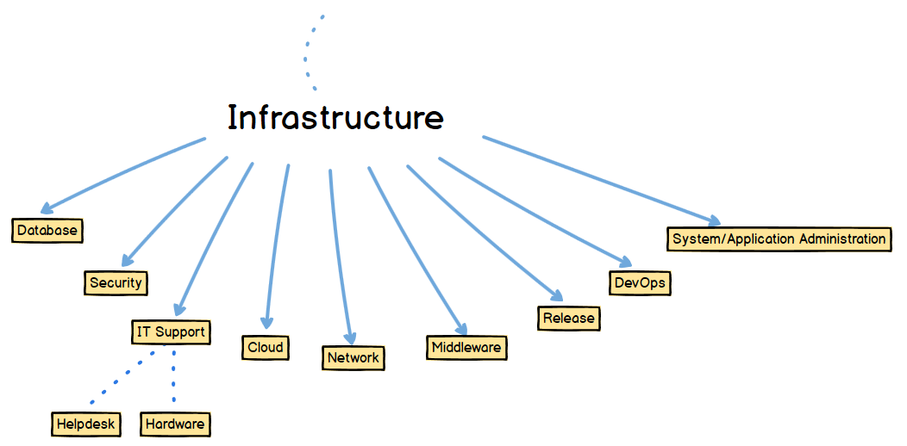

# IT Jobs Roadmap (2020) (WIP)
Roadmap for different IT jobs.

**Initial Objective:**
1. Serve as guide to different people about different IT job roles available.
2. Categorize by purpose (Dev, Infra, Archi, etc.) then by platform (Web, Desktop, Mobile, etc.) the different IT jobs.
3. List possible job levels.
4. List sample job roles or titles.

### Analyst
- Data Analyst or Data Scientist

## Developer Roadmap

### Backend
- _________ Developer
    - Technology specific: Java, C, C++, C#, .Net, Node.js, Python, etc.
- R&D Engineer
- Backend Engineer
    #### Mainframe
    - COBOL Developer

### Full Stack
- Full-Stack Web Developer
    
### Web
- Junior Web Developer
- Web Developer
- Front-End Developer
- PHP Web Developer
    #### BPM
    - Pega Developer
    #### CMS
    - WordPress Developer

## Infrastructure Roadmap

## Infrastructure Roadmap

### Network/Application Tester
- Penetration Tester
- Forensic Specialist

## References
- https://github.com/kamranahmedse/developer-roadmap
- https://www.itcareerfinder.com/it-careers.html
- http://www.ictjob.ph/top-10-applied-jobs-philippines
- http://www.aim.ph/blog/top-10-jobs-it-graduates-philippines/
- https://www.reddit.com/r/ITCareerQuestions/comments/8a1czt/common_it_career_paths_roadmap_visual/

## 🙌 Contribution
This is in its initial state and mostly came from my or a colleague's experiences.
  If you have any suggestions on how we can improve this roadmap, feel free to discuss the ideas in issues.
  We will be very happy to hear your thoughts.
- Open pull request with improvements
- Discuss ideas in issues
- Spread the word